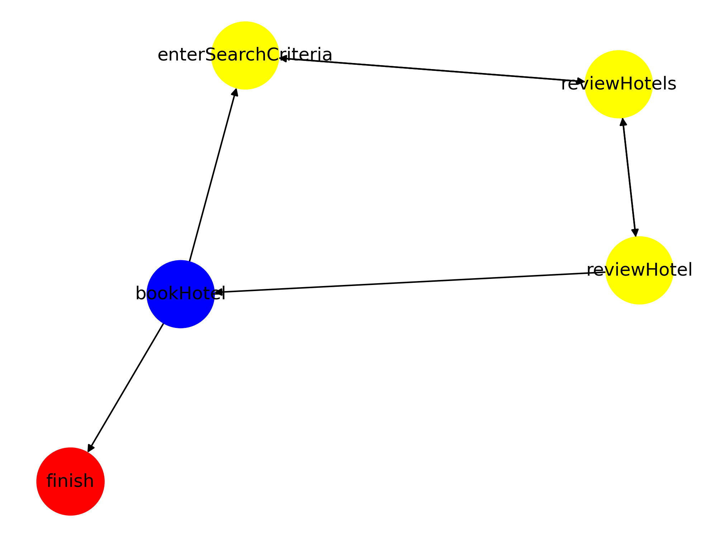

# SpringWebFlowViewer
View Spring Webflow file as Directed Graph. 

## Testing
```
flow_viewer.py spring-webflow-samples\booking-faces\src\main\webapp\WEB-INF\flows\main\main-flow.xml
```

Should result in the following.


